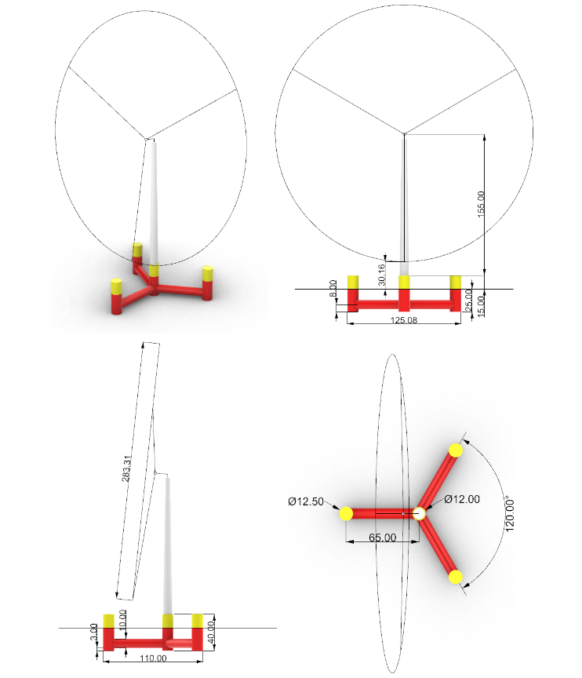
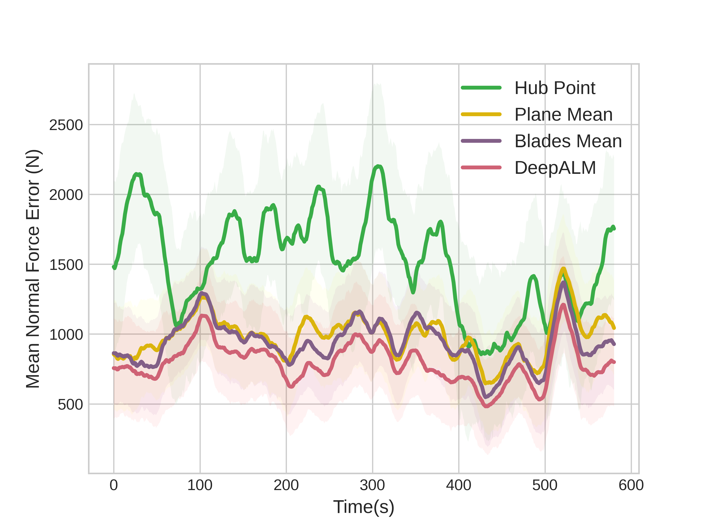
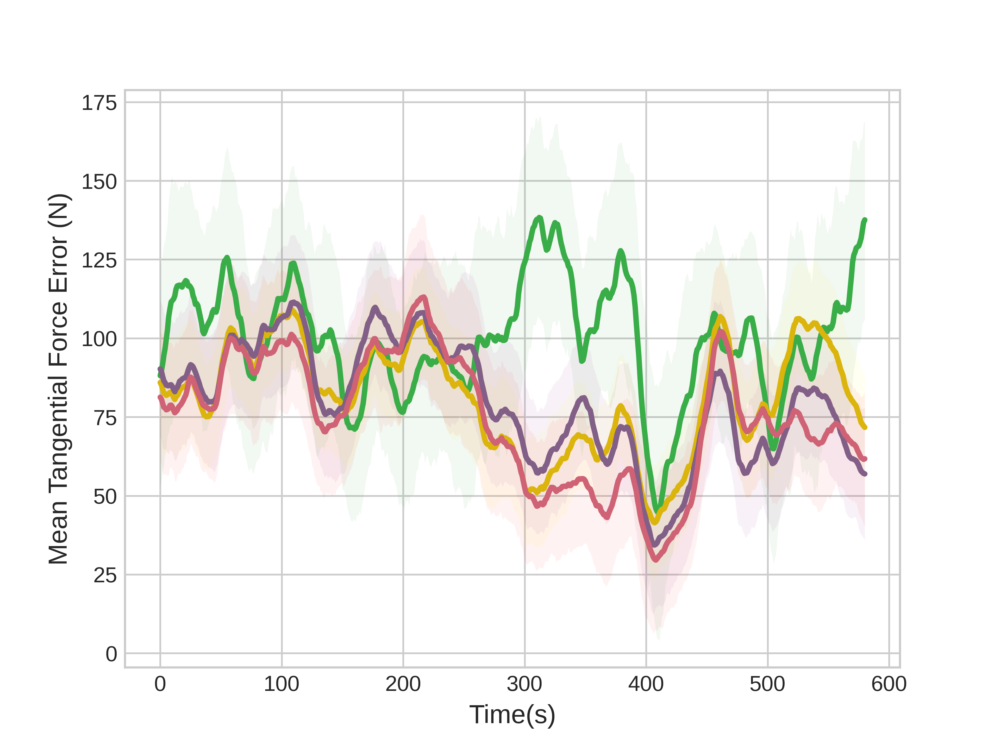
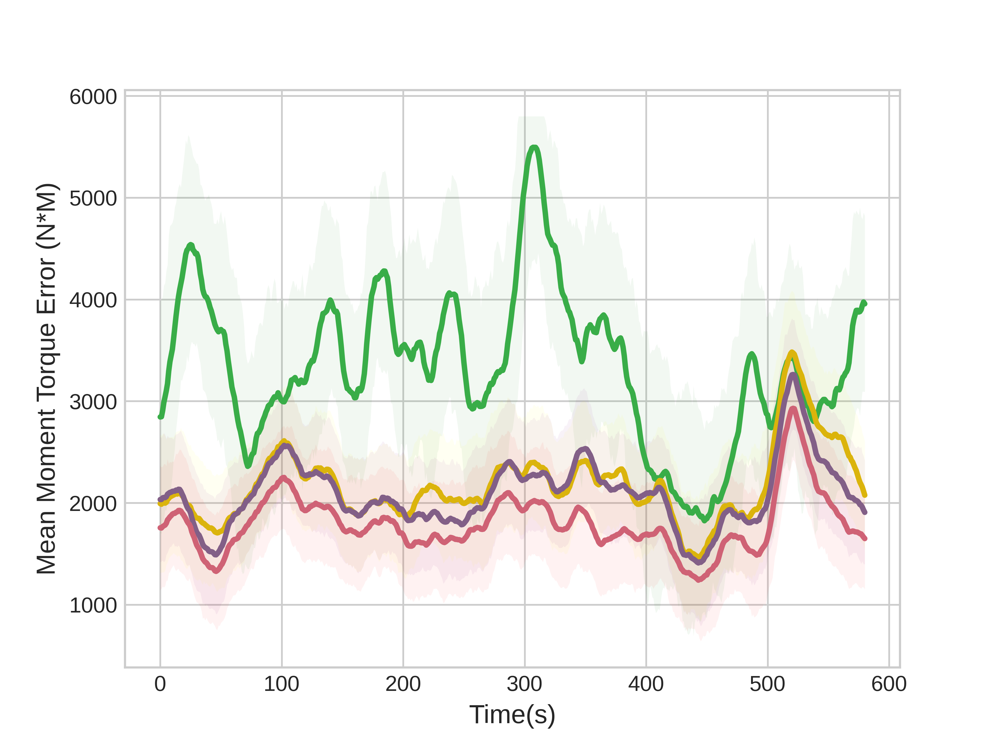
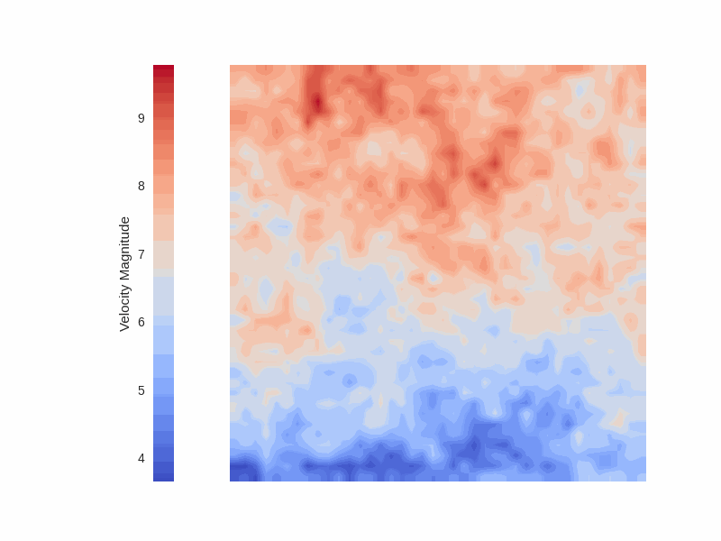

# WindFore and DeepALM for Yaw Control of IEA 22MW Wind Turbine

This is the code repository for the paper entitled '**Physics-Inform Wind Estimation for Predictive Yaw Control of Utility-Scale Wind Turbines**'

## Dependenices
Before using this code, please install the following packages:
```
tensorboard              2.16.2
tensorboard-data-server  0.7.2
torch                    2.2.1
torchaudio               2.2.1
torchmetrics             1.3.2
torchvision              0.17.1
numpy                    1.26.4
h5py                     3.11.0
matplotlib               3.8.3
```

## Training Data
Due to the storage limit, the training data for WindFore and DeepALM is not uploaded.
First, you may use [TurbSim](https://www.nrel.gov/wind/nwtc/turbsim.html) to generate the required data.

Otherwise, you can contact us to acquire the data fold. 

Additionally, please visit this [repo](https://github.com/IEAWindTask37/IEA-22-280-RWT) for the very detailed introduction of IEA 22MW wind turbine. 

<div style="display: flex; justify-content: center;">
    
</div>

## Train the models

Please see the training parameters in specific python files. 

### Train DeepALM

```
nohup ./run_deepalm.sh > DeepALM.log 2>&1 &
```

### Train WindFore

```
nohup ./run_windfore.sh > WindFore.log 2>&1 &
```


## Results

### DeepALM
<div style="display: flex; justify-content: space-between;">
    
    
    
</div>

### WindFore

| | | |
|:-------------------------:|:-------------------------:|:-------------------------:|
|    |   |   |

